# END-TO-END DevOps Workflow
-----------------------------
	1. Planing
	2. Development 
	3. CI - Continuos Integration 
	4. CD - Continuos Deploy
	5. CD - Continuos Delivery
	6. Monitoring 
  
## Scenario - Example 
	
 1. The client requested a change in the application’s background color He requeste was documentaed in JIRA ticket with detailed information 
 
 2. The Ticket was assigned to a Developer, The Develeloper completed required changes into the application code, he perform some local testing everythin fine he pushed code to GITHUB 

  -  As a DevOps i will create pipeline to automate the process 
  - Download code 
  - compile the source code for syntax error 
  - i will perform some unit testing 
  - For Code Quality check and code smells, to find bugs use SonarQube to check code vulnerability 
  - Using trivy for to find vulnerability in source code and find sensitive data and scan dependency required for application check vulnerability and outdated or any issues it shows 
  - Now build artifact with build tool 
  - publish the artifact into nexus repo so we can do proper release management version of the artifact 
  - build the dockerfile with artifact
  - scan docker image with trivy to find vulnerability
  - push docker image into dockerhub 
  - Now deploy dockerimage into k8s with manifest files 

- Monitor Application, Servers, pods 


## Jenkins Server Setup
1. Launch Server with Installed softwares (8080,22)
	- openjdk-17-jdk
	- jenkins
	- maven
	- git
	- docker
	- trivy
	- kubectl 

## SonarQube Server
 - SonarQube is a very important tool for maintaining and improving code quality, by automating static code analysis, it will help developers to catch issues early ensure code is secure and efficient 
 
1. Launch Server 2cpu and 4gb ram 20gb storage with Docker (ports open 9000,22)
 
 - Run SonarQube Server with Docker container 
	
 ```bash
 docker run --name sonar-server -d -p 9000:9000 sonarqube:lts-community  
 ```
 - Access http://<public_ip>:9000
	usrname: admin
	pswd: admin

2. Generate Token in Sonarqube 
	Administration->security->create 
	  name: sr-token
		-> copy sr-token -> add in the jenkins credentials with name "sonar-token"    

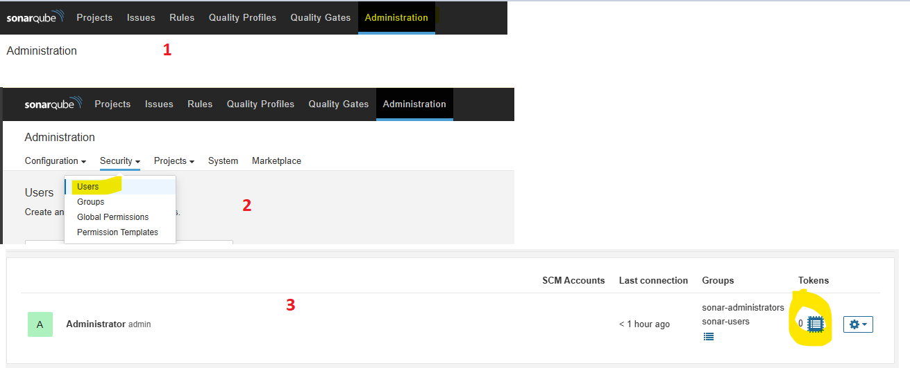

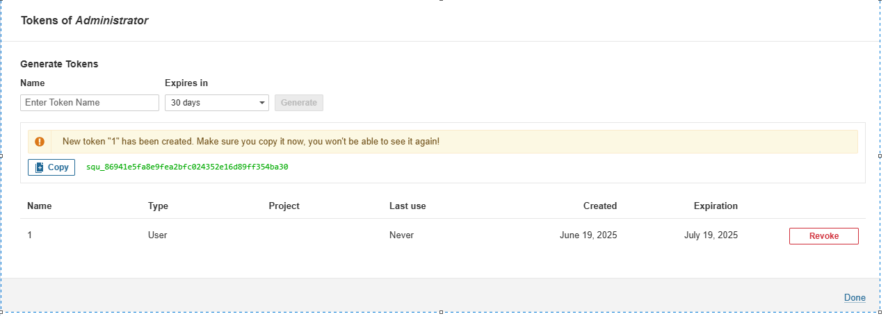
 
 3. Generate Webhooks in SonarQube server 
	Administration->configuration->webhooks->create->
		name: jenkins
		URL: http://<jenkins_publi_ip>:8080/sonarqube-webhook/
		
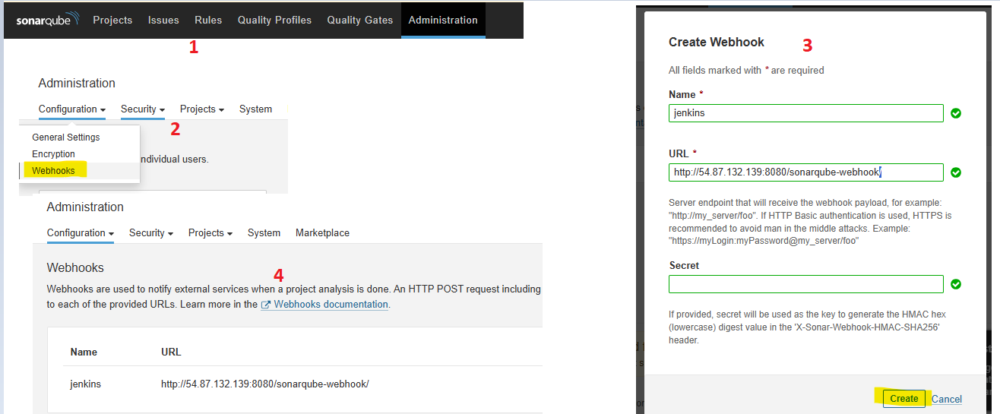

## Nexus Repository Server  
 - It Provides centrolized management of artifact, including binaries, docker containers and build artifacts, it will store and retrive artifacts, it works as centralized location for managing dependencies and artifacts  
 
 1. Launch Server 2cpu and 4gb ram 20gb storage with Docker 
  - Run Nexus Server with Docker container 
	```bash
	 sudo docker run -d --name nexus -p 8081:8081 sonatype/nexus3
	```
	- Access http://<public_ip>:8081
	- Get Password container 
	
	```bash	
	docker exec -it Nexus bash
	```
		
  >> cat sonartype-work/admin.password -> copy this password 
	
 - Access from brwoser 
	usrname: admin
	pswd : ************* -> paste here copied password 


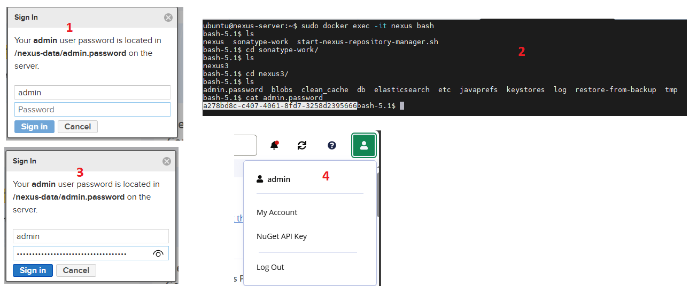

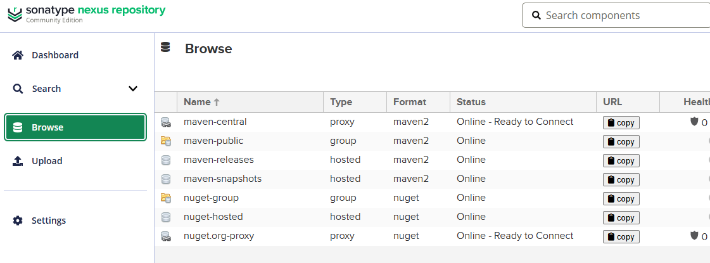


 2. ordered to publish our artifact into Nexus we have to add repository URL in our POM.XML file 
 	find-> maven-releases -> copy (http://13.232.105.162:8081/repository/maven-releases/) ->copy this 
 	find-> maven-snapshots -> copy (http://13.232.105.162:8081/repository/maven-snapshots/) ->copy this 

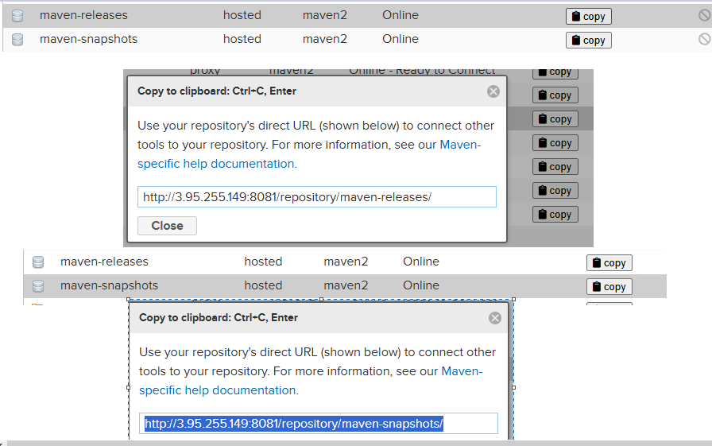


 	Open pom.xml file find "distributionManagement" add above details like below in pom.xml file 

 ```xml
 <distributionManagement>
    <repository>
        <id>maven-releases</id>
        <url>http://13.201.64.186:8081/repository/maven-releases/</url>
    </repository>
    <snapshotRepository>
        <id>maven-snapshots</id>
        <url>http://13.201.64.186:8081/repository/maven-snapshots/</url>
    </snapshotRepository>
 </distributionManagement>
 ```	

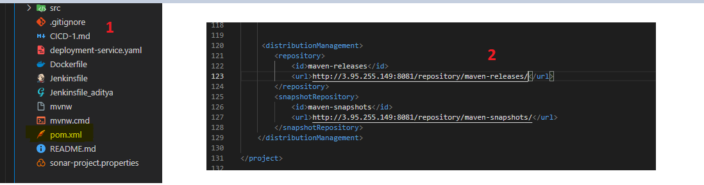

## Configure Jenkins Server 

 ### Plugins-Download
  1. Eclipse Temurin installer
  2. config file provider 
  3. pipeline maven integration 
  4. sonarqube scanner 
  5. docker
  6. docker pipeline
  7. kuberenetes
  8. kuberenetes cli
  9. kuberenetes client API
  10. kuberenetes credentials 
  11. maven integration 

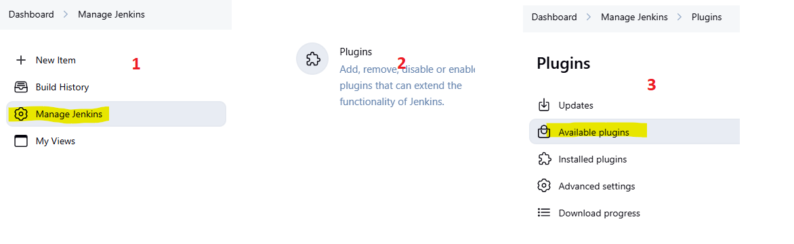

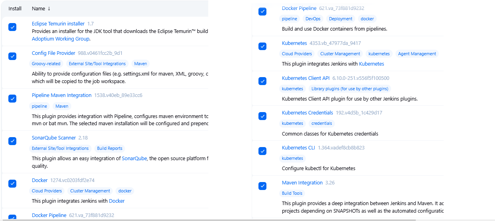


 ### Add Credentials 
  - Manage Jenkins->credentials->Globals
	 1. sonarqube  
		kind: secret text 
		secret:(*****) ->paste here "sr-token" received from sonarQube token
		id: sonar-token
		description: sonar-token  

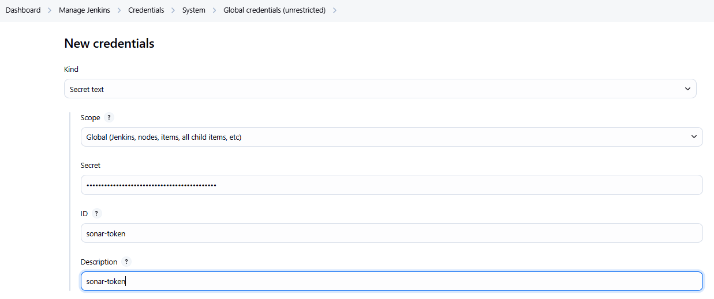

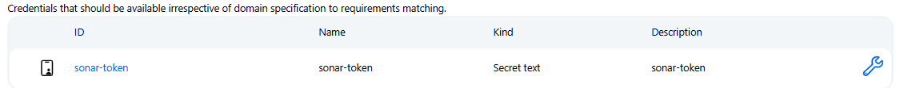

	 2. Add dockerhub credentials 
		usrname: navathej408
		pswd: ****
		id: docker-cred
		cred: docker-cred

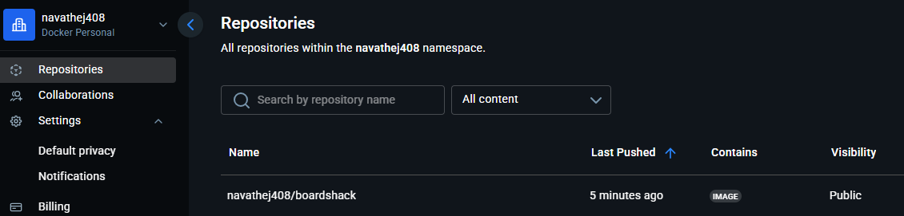

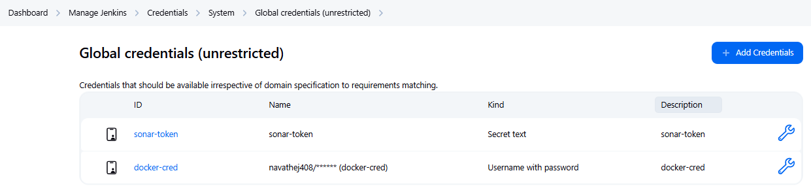


 ### Configuring Tools 
  - DashBoard->Manage Jenkins->Tools->
	 1. Java 
	   name : jdk17
		- select install automatically (install from adopetium.net(17 version))
	 2. SonarQube Scanner Installations
	   name : sonar-scanner 
		- select install automatically (sonarQube scanner 5.0.1.3006)
	 3. maven 
	   name : maven3 
		-> Install from Apache (version 3.6.1)
	 4. Docker 
	   name : docker 
		- select insatll automatically (latest) 

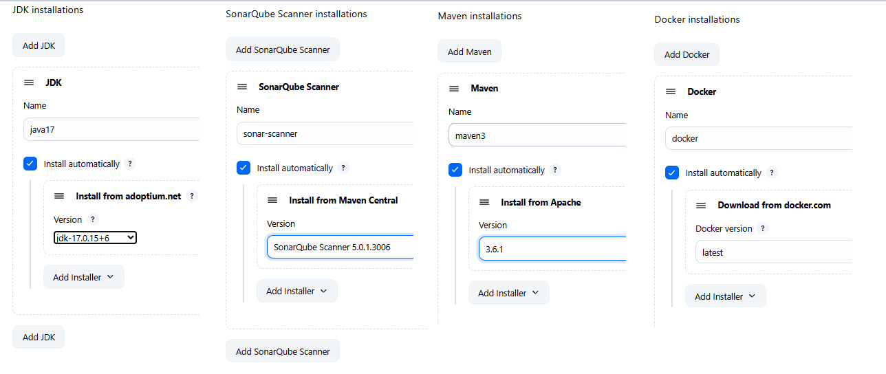

 ### Configure Systems 
  - Manage Jenkins-> System-> 
	1. SonarQube Servers
	 name: sonar
	 server URL : http://<public_ip>:9000
	 server authentication token: sonar-token
    
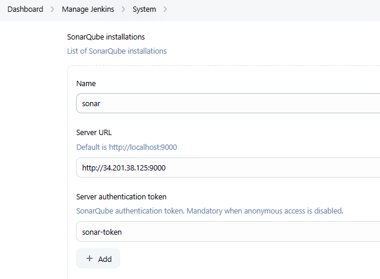

### To Access Nexus From Jenkins pipeline 
 - In ordered to publish an artifact to Nexus Repository we have to setup a process 
 - to access Nexus server we have to download a plugin "config file provider" this plugin we already downloaded so after this in jenkins a section available in =====>  Manage Jenkins-> Managed File  

 - open that location 

 - Manage Jenkins-> Managed File -> add a new config -> type (select Global Maven settings.xml) 
	id : (global-settings)  

 - content: --> file generated below 

 - find in the below servers section 
 	```xml
	<server>
	  <id>maven-releases</id>
	  <username>admin</username>
	  <password>nexus-pswd</password>
	</server>

	<server>
	  <id>maven-snapshots</id>
	  <username>admin</username>
	  <password>nexus-pswd</password>
	</server>
	```
  - clikc on submit

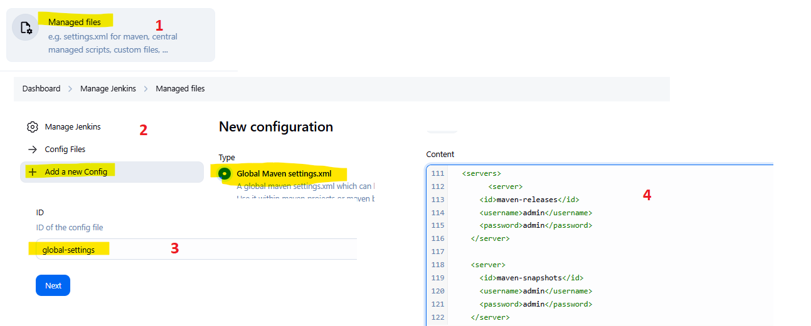

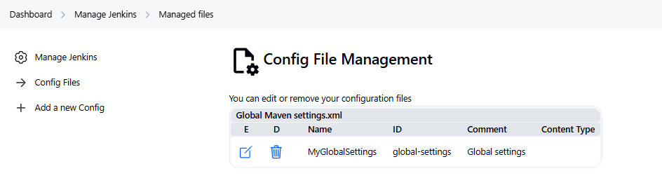


# Complete Pipeline 

```bash

pipeline {
    agent any
    
    tools {
        jdk 'java17'
        maven 'maven3'
    }

	# Below step only add when you add stage of sonarqube 
    enviornment {
        SCANNER_HOME= tool 'sonar-scanner'  
    }

    stages {
        stage('Git Checkout') {
            steps {
               git branch: 'main', credentialsId: 'git-cred', url: 'https://github.com/jaiswaladi246/Boardgame.git'
            }
        }
        
        stage('Compile') {
            steps {
                sh "mvn compile"
            }
        }
        
        stage('Test') {
            steps {
                sh "mvn test"
            }
        }
        
        stage('File System Scan') {
            steps {
                sh "trivy fs --format table -o trivy-fs-report.html ."
            }
        }
        
        stage('SonarQube Analsyis') {
            steps {
                withSonarQubeEnv('sonar') {
                    sh ''' $SCANNER_HOME/bin/sonar-scanner -Dsonar.projectName=BoardGame -Dsonar.projectKey=BoardGame \
                            -Dsonar.java.binaries=. '''
                }
            }
        }
        
        stage('Quality Gate') {
            steps {
                script {
                  waitForQualityGate abortPipeline: false, credentialsId: 'sonar-token' 
                }
            }
        }
        
        stage('Build') {
            steps {
               sh "mvn package"
            }
        }
        
        stage('Publish To Nexus') {
            steps {
               withMaven(globalMavenSettingsConfig: 'global-settings', jdk: 'jdk17', maven: 'maven3', mavenSettingsConfig: '', traceability: true) {
                    sh "mvn deploy"
                }
            }
        }
        
        stage('Build & Tag Docker Image') {
            steps {
               script {
                   withDockerRegistry(credentialsId: 'docker-cred', toolName: 'docker') {
                            sh "docker build -t adijaiswal/boardshack:latest ."
                    }
               }
            }
        }
        
        stage('Docker Image Scan') {
            steps {
                sh "trivy image --format table -o trivy-image-report.html adijaiswal/boardshack:latest "
            }
        }
        
        stage('Push Docker Image') {
            steps {
               script {
                   withDockerRegistry(credentialsId: 'docker-cred', toolName: 'docker') {
                            sh "docker push adijaiswal/boardshack:latest"
                    }
               }
            }
        }
        stage('Deploy To Kubernetes') {
            steps {
               withKubeConfig(caCertificate: '', clusterName: 'kubernetes', contextName: '', credentialsId: 'k8-cred', namespace: 'webapps', restrictKubeConfigAccess: false, serverUrl: 'https://172.31.8.146:6443') {
                        sh "kubectl apply -f deployment-service.yaml"
                }
            }
        }
        
        stage('Verify the Deployment') {
            steps {
               withKubeConfig(caCertificate: '', clusterName: 'kubernetes', contextName: '', credentialsId: 'k8-cred', namespace: 'webapps', restrictKubeConfigAccess: false, serverUrl: 'https://172.31.8.146:6443') {
                        sh "kubectl get pods -n webapps"
                        sh "kubectl get svc -n webapps"
                }
            }
        }
        
        
    }
    post {
    always {
        script {
            def jobName = env.JOB_NAME
            def buildNumber = env.BUILD_NUMBER
            def pipelineStatus = currentBuild.result ?: 'UNKNOWN'
            def bannerColor = pipelineStatus.toUpperCase() == 'SUCCESS' ? 'green' : 'red'

            def body = """
                <html>
                <body>
                <div style="border: 4px solid ${bannerColor}; padding: 10px;">
                <h2>${jobName} - Build ${buildNumber}</h2>
                <div style="background-color: ${bannerColor}; padding: 10px;">
                <h3 style="color: white;">Pipeline Status: ${pipelineStatus.toUpperCase()}</h3>
                </div>
                <p>Check the <a href="${BUILD_URL}">console output</a>.</p>
                </div>
                </body>
                </html>
            """

            emailext (
                subject: "${jobName} - Build ${buildNumber} - ${pipelineStatus.toUpperCase()}",
                body: body,
                to: 'jaiswaladi246@gmail.com',
                from: 'jenkins@example.com',
                replyTo: 'jenkins@example.com',
                mimeType: 'text/html',
                attachmentsPattern: 'trivy-image-report.html'
            )
        }
    }
}

}
```


# Softwares to download 
```bash
# On Jenkins server setup softwares 
# Jenkins and java Download 
sudo apt update -y
sudo apt install openjdk-17-jdk -y
sudo wget -O /etc/apt/keyrings/jenkins-keyring.asc \
  https://pkg.jenkins.io/debian-stable/jenkins.io-2023.key
echo "deb [signed-by=/etc/apt/keyrings/jenkins-keyring.asc]" \
  https://pkg.jenkins.io/debian-stable binary/ | sudo tee \
  /etc/apt/sources.list.d/jenkins.list > /dev/null
sudo apt-get update
sudo apt-get install jenkins
# trive download 
sudo apt-get install wget apt-transport-https gnupg lsb-release
wget -qO - https://aquasecurity.github.io/trivy-repo/deb/public.key | sudo apt-key add -
echo deb https://aquasecurity.github.io/trivy-repo/deb $(lsb_release -sc) main | sudo tee -a /etc/apt/sources.list.d/trivy.list
sudo apt-get update
sudo apt-get install trivy

# On sonarqube server 
curl -fsSL https://get.docker.com -o install-docker.sh
sh install-docker.sh
docker run --name sonar-server -d -p 9000:9000 sonarqube:lts-community

# On nexus server 
curl -fsSL https://get.docker.com -o install-docker.sh
sh install-docker.sh
sudo docker run -d --name nexus -p 8081:8081 sonatype/nexus3
```

```bash
pipeline {
    agent any
    tools {
        jdk 'java17'
        maven 'maven3'
    }

    stages {
        stage('checkout') {
            steps {
			cleanWs()
            git branch: 'main', url: 'https://github.com/jaiswaladi246/Boardgame.git'
            }
        }
        stage('Test') {
            steps {
                sh "mvn test"
            }
        }
		stage('File System Scan') {
            steps {
                sh "trivy fs --format table -o trivy-fs-report.html ."
            }
        }
	}
}
```

